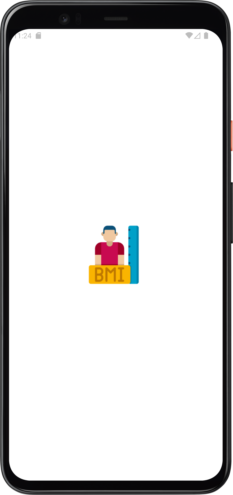
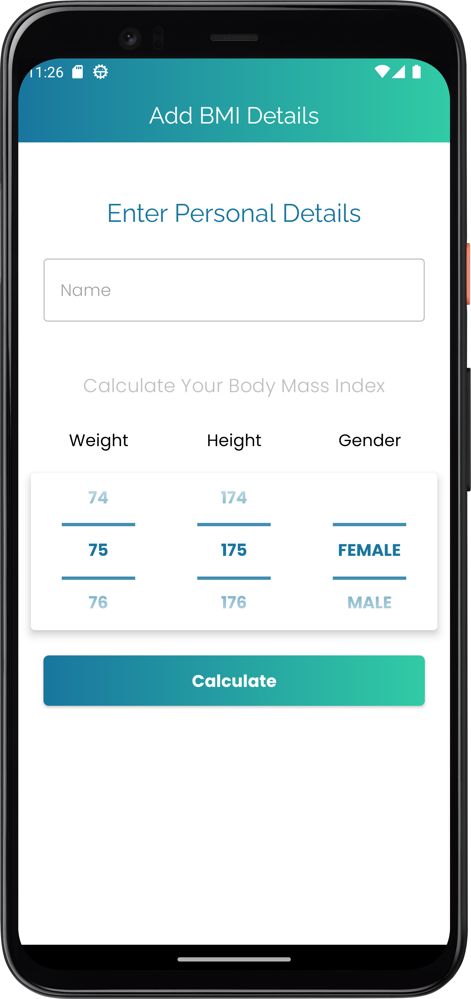
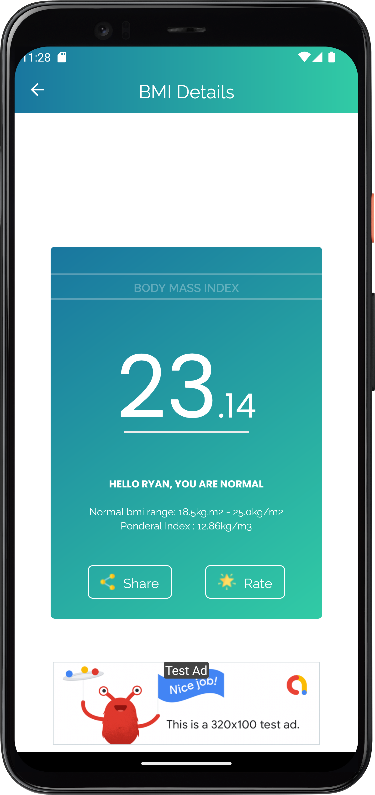

<!-- PROJECT SHIELDS -->
<!--
* I'm using markdown "reference style" links for readability.
* Reference links are enclosed in brackets [ ] instead of parentheses ( ).
* See the bottom of this document for the declaration of the reference variables
* for contributors-url, forks-url, etc. This is an optional, concise syntax you may use.
* https://www.markdownguide.org/basic-syntax/#reference-style-links
-->
[![Contributors][contributors-shield]][contributors-url]
[![Forks][forks-shield]][forks-url]
[![Stargazers][stars-shield]][stars-url]
[![Issues][issues-shield]][issues-url]
[![MIT License][license-shield]][license-url]

# BMI Application

> A beatifully designed application with which users can use to calculate their BMI and Ponderal indexes to help them keep track of their health.

## Built With
- Kotlin

### Dependencies Used
- Fragment & Fragment Navigation
- Splashscreen API
- Google AdMob
- Truth
- Espresso
- Mockito
- Fragment Testing
- TestNavController

## Screenshots
  

## Getting Started

To get a local copy up and running follow these simple example steps.

### Prerequisites
-  Installed Android Studio or Any other android development IDEs and their respective dependencies

## 🤝 Contributing

Contributions, issues, and feature requests are welcome!
You can pick a thing to do from the list provided above and work on it.

Feel free to check the [issues page](../../issues/) or [discussions page](../../discussions).

## Show your support

Give a ⭐ if you like this project!

## Acknowledgments

-

## 📝 License

This project is [MIT](./MIT.md) licensed.

<!-- MARKDOWN LINKS & IMAGES -->
<!-- https://www.markdownguide.org/basic-syntax/#reference-style-links -->
[contributors-shield]: https://img.shields.io/github/contributors/RyanKoech/bmiApp-newAgeTest.svg?style=for-the-badge
[contributors-url]: https://github.com/RyanKoech/bmiApp-newAgeTest/graphs/contributors
[forks-shield]: https://img.shields.io/github/forks/RyanKoech/bmiApp-newAgeTest.svg?style=for-the-badge
[forks-url]: https://github.com/RyanKoech/bmiApp-newAgeTest/network/members
[stars-shield]: https://img.shields.io/github/stars/RyanKoech/bmiApp-newAgeTest.svg?style=for-the-badge
[stars-url]: https://github.com/RyanKoech/bmiApp-newAgeTest/stargazers
[issues-shield]: https://img.shields.io/github/issues/RyanKoech/bmiApp-newAgeTest.svg?style=for-the-badge
[issues-url]: https://github.com/RyanKoech/bmiApp-newAgeTest/issues
[license-shield]: https://img.shields.io/github/license/RyanKoech/bmiApp-newAgeTest.svg?style=for-the-badge
[license-url]: https://github.com/RyanKoech/bmiApp-newAgeTest/blob/master/LICENSE
